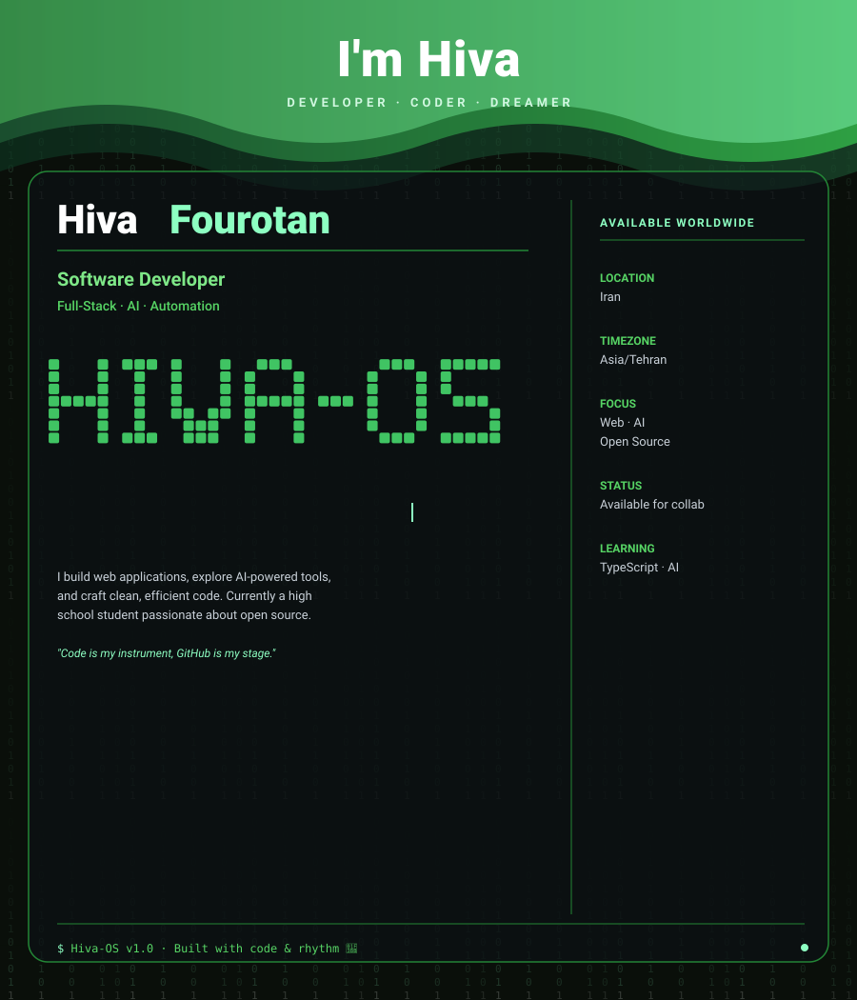

<!-- ═══════════════ 🌊 HEADER (امواج) + 🌧️ MATRIX BACKGROUND ═══════════════ -->
<div align="center" style="position: relative;">
  
  
</div>

<!-- ═══════════════ ⌨️ نام متحرک ═══════════════ -->
<div align="center">
  <a href="https://github.com/HivaFourotan">
    
  </a>
</div>

<!-- ═══════════════ 🎨 SVG اختصاصی Hiva-OS ═══════════════ -->
<div align="center">
  
</div>

<!-- ═══════════════ 🐍 اسنیک ═══════════════ -->
<div align="center">
  
</div>

---

<!-- ═══════════════ 🛠️ TECH STACK ═══════════════ -->
<div align="center">

## 🛠️ Tech Stack

**Languages & Frontend**


**Backend & Tools**


</div>

---

<!-- ═══════════════ 🔥 STREAK STATS ═══════════════ -->
<div align="center">

## 🔥 My Streak


</div>

---

<!-- ═══════════════ 💼 FEATURED PROJECTS ═══════════════ -->
<div align="center">

## 💼 Featured Projects

<a href="https://github.com/HivaFourotan/REPO-1">
  
</a>
<a href="https://github.com/HivaFourotan/REPO-2">
  
</a>
<br/>
<a href="https://github.com/HivaFourotan/REPO-3">
  
</a>

</div>

---

<!-- ═══════════════ 🏢 OUR ORGANIZATION ═══════════════ -->
<div align="center">

## 🏢 Our Organization

<a href="https://github.com/YOUR-ORG">
  
</a>

> 💡 **Me and my friends built a team** — we're crafting cool projects together!

</div>

---

<!-- ═══════════════ 🧑‍💻 ABOUT ME ═══════════════ -->
<div align="center">

## 🧑‍💻 About Me

</div>

```typescript
const me = {
  name: "Hiva",
  role: "Developer 🚀",
  location: "Iran 🇮🇷",
  languages: ["JavaScript", "Python", "TypeScript"],
  hobbies: ["Coding", "Open Source", "violin", "High School"],
  currentFocus: "HTML - TypeScript - AI",
  funFact: "I won't sleep before the code works"
};
